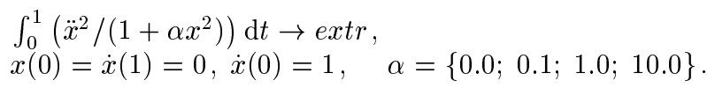

# Optimization problem solution
C++ program implementing numerical methods to solve optimization problem.
The 5th order Runge-Kutta method, Newton's method and Gauss elimination are used to solve the problem.

The problem is stated as follows:

The step of reducing the optimization problem to a Cauchy problem was performed manually on paper.
